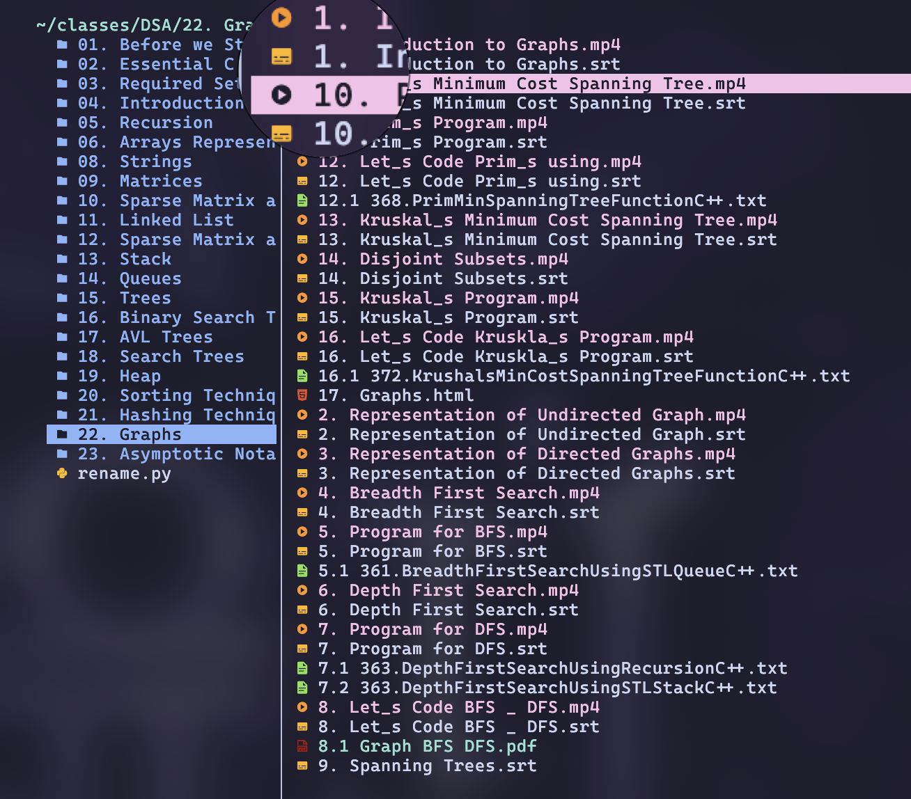

# PadMan

A utility for normalizing numeric prefixes in filenames. It just pads `0` to the beginning till all the filenames start with the same number of digits and therefore are sorted correctly.

## Why?

To fix this mess.



If you noticed, there's one `rename.py` in the left sidebar. That was the initial script I wrote for this. It worked perfectly. But what's the point of knowing JS if I can't publish my random garbage on NPM? Hence, this. 

## Installation

Run directly with npx:

```bash
npx padman [directory] [options]
```

Install globally:

```bash
npm install -g padman
```

Install in a project:

```bash
npm install padman
```

## Usage

### Command Line Interface

```bash
# Rename files in the current directory
padman

# Rename files in a specific directory
padman /path/to/directory

# Preview changes without actually renaming (dry run)
padman --dry-run
padman -d
```

### API Usage

```typescript
import { renameFiles } from 'padman';

async function example() {
  try {
    // Rename files in a directory
    const results = await renameFiles('/path/to/directory');
    console.log(results);
    
    // Dry run - just report what would change, don't actually rename
    const dryRunResults = await renameFiles('/path/to/directory', { dryRun: true });
    console.log(dryRunResults);
  } catch (error) {
    console.error('Error:', error);
  }
}

example();
```

## What it does

This utility looks for files with numeric prefixes (like `11-file.txt`, `2-file.txt`) and renames them to have consistent padding with leading zeros (like `11-file.txt`, `02-file.txt`).

This makes alphabetical sorting work properly for collections of numbered files.

## API Reference

### `renameFiles(directory, options)`

Renames files in a directory to have consistent numeric prefixes.

- `directory` (string): The directory containing files to rename
- `options` (object, optional):
  - `dryRun` (boolean): When true, doesn't actually rename files, just shows what would happen

Returns: Promise<string[]> - Array of messages describing the actions taken

### `validateDirectory(directory)`

Validates if a path exists and is a directory.

- `directory` (string): The directory path to validate

Returns: Promise<boolean> - Resolves to true if valid, throws error otherwise

### `getMaxDigitLength(files)`

Gets the maximum digit length of numeric prefixes in filenames.

- `files` (string[]): Array of filenames to analyze

Returns: number - The maximum digit length found, or 0 if none

## License

ISC
